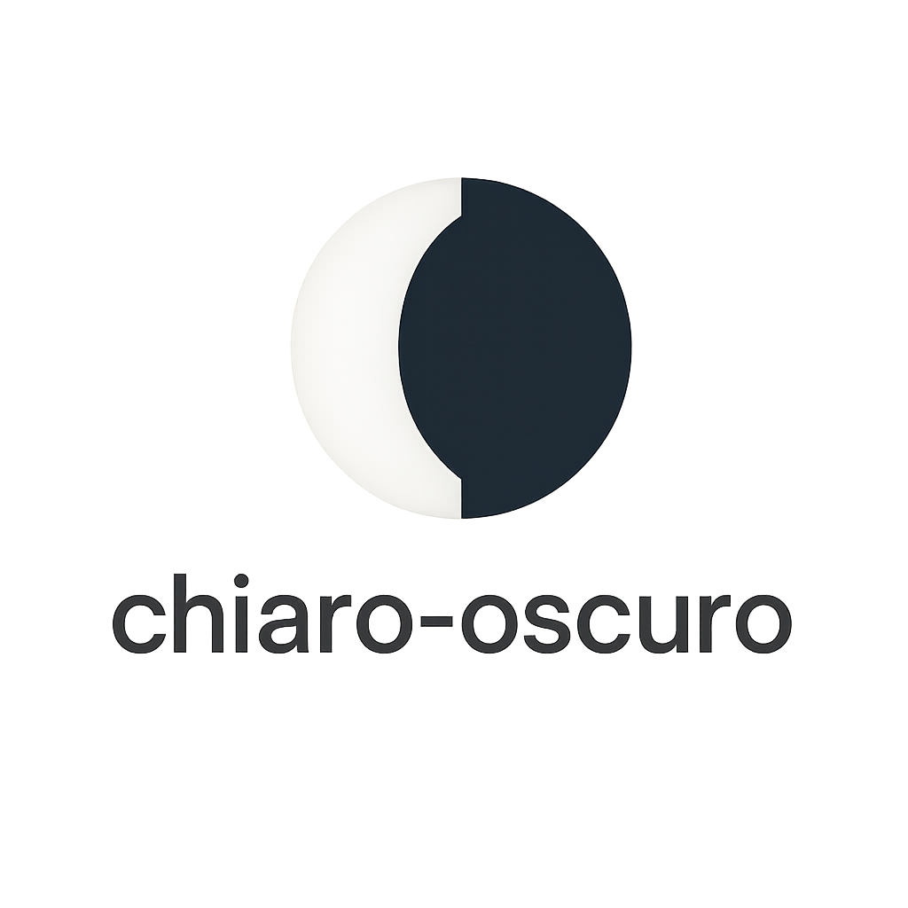
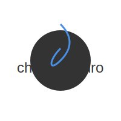
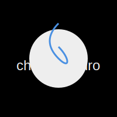

<p align="center">
  <picture>
    <source media="(prefers-color-scheme: dark)" srcset="assets/logo-dark.svg">
    <source media="(prefers-color-scheme: light)" srcset="assets/logo-light.svg">
    
  </picture>
</p>

# chiaro-oscuro 🌓

**Automatically optimize your repository logos for light and dark themes using AI**

## ✨ See It In Action

**chiaro-oscuro** takes your existing logo and creates optimized variants for both light and dark themes:

<div align="center">

| Light Theme | Dark Theme |
|-------------|------------|
|  |  |
| **Perfect for light backgrounds** | **Perfect for dark backgrounds** |
| High contrast, dark elements | High contrast, light elements |

</div>


## 🔧 Troubleshooting

### "GitHub Actions is not permitted to create or approve pull requests"

**Solution**: Enable PR creation in your repository:
1. Go to your repository **Settings**
2. Navigate to **Actions** > **General**  
3. Scroll to **Workflow permissions**
4. Check **"Allow GitHub Actions to create and approve pull requests"**
5. Click **Save**


### "Models permission required"

**Solution**: Add the `models: read` permission to your workflow:
```yaml
permissions:
  contents: write
  pull-requests: write
  models: read  # ← Required for GitHub Models
```

## 📄 License

MIT © 2025 Jason McPheron


```markdown
[](https://github.com/jmcpheron/chiaro-oscuro)
```